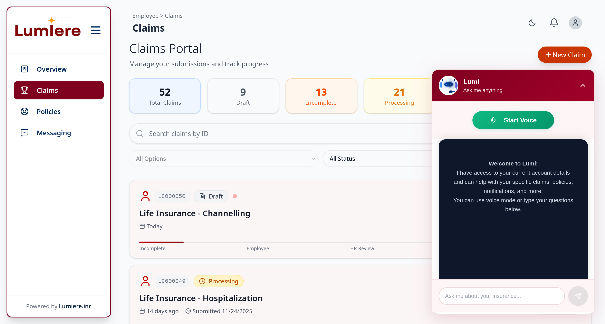
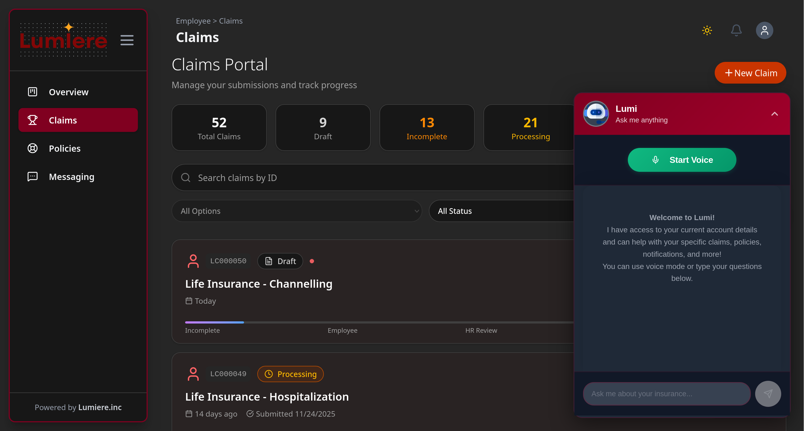
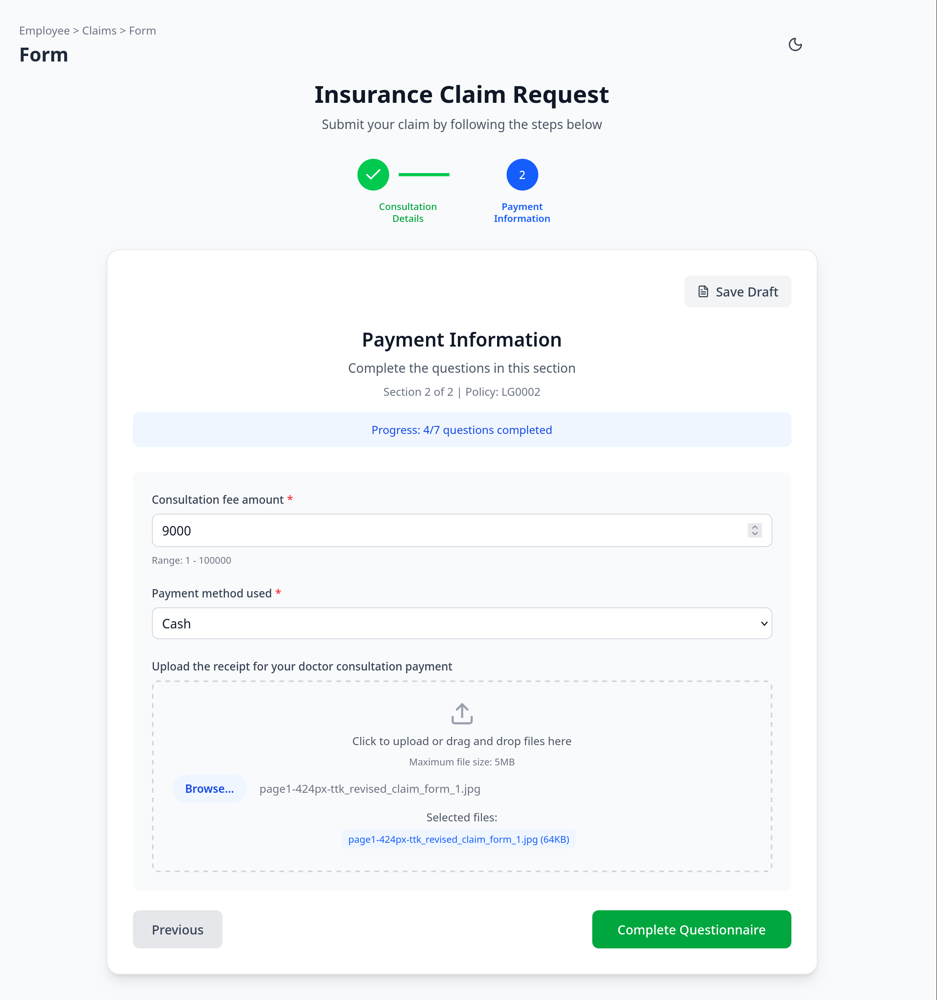
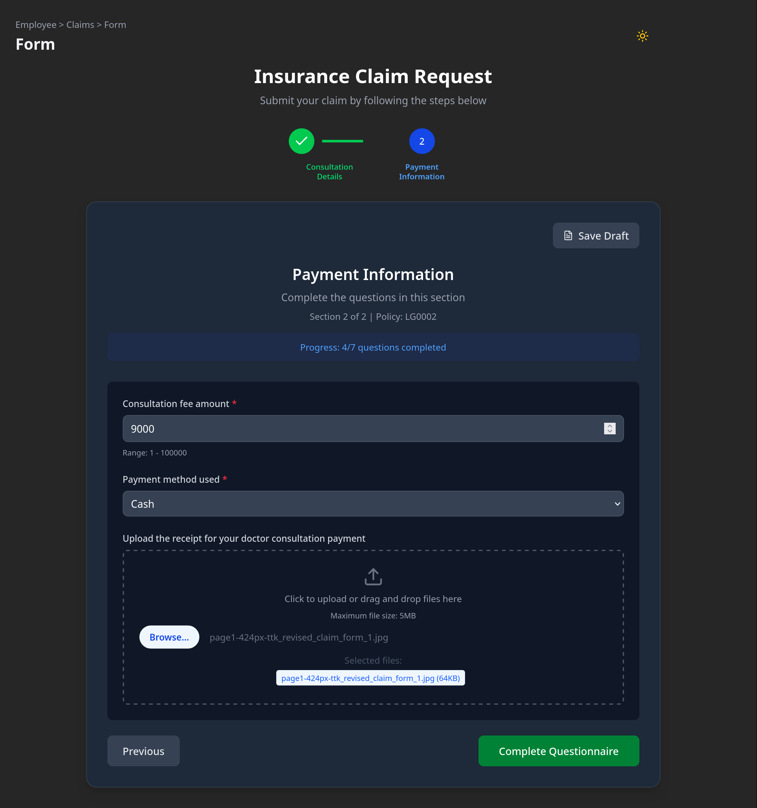
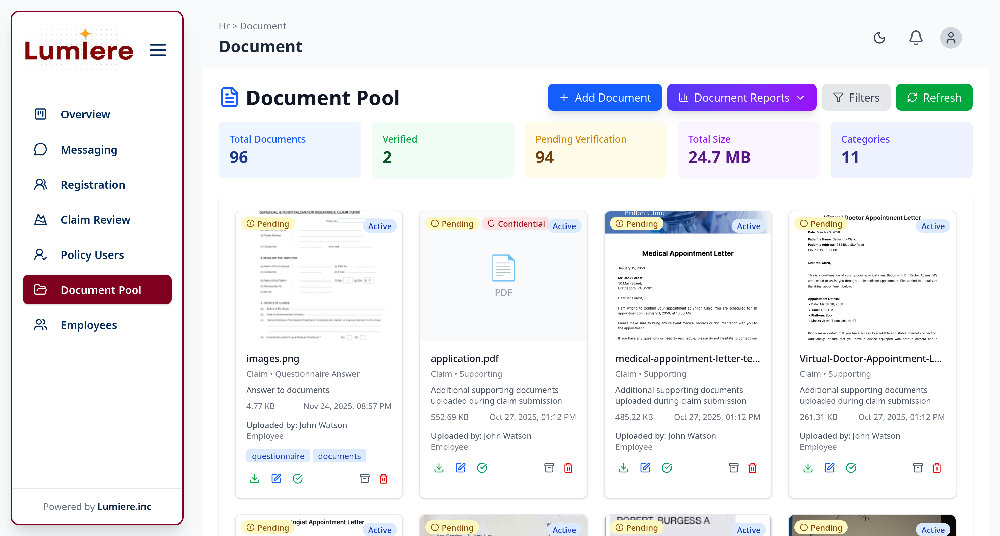
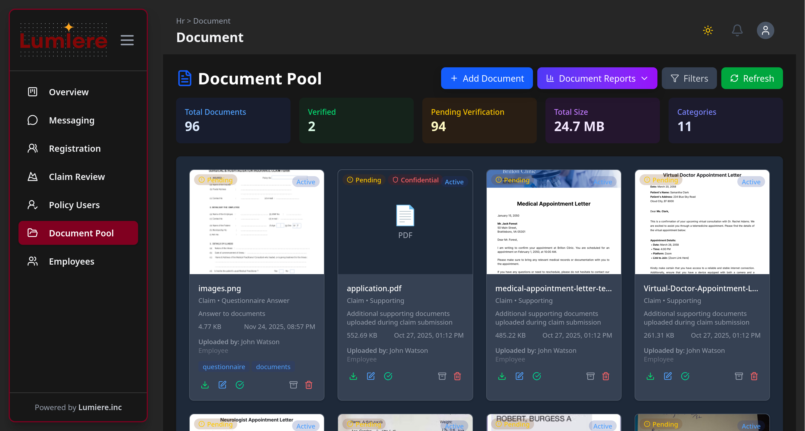
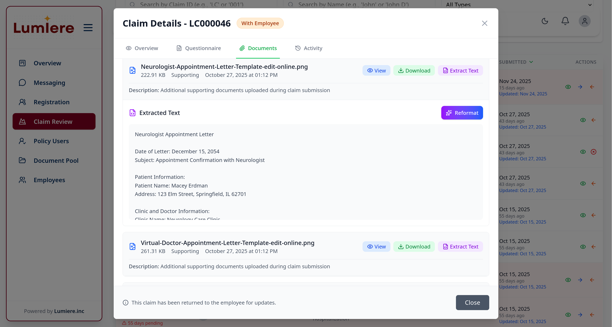
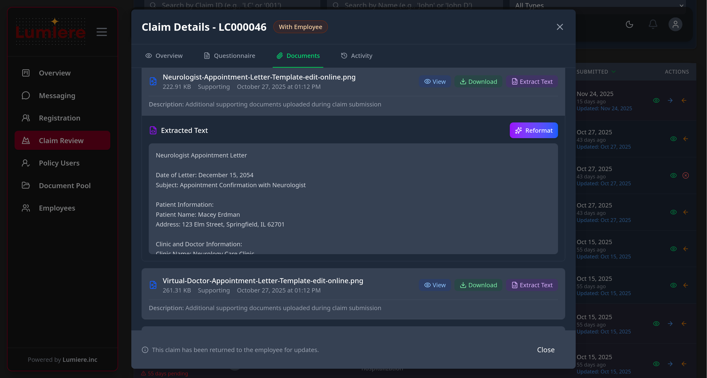

# Lumiere

A full-stack insurance claims management platform with AI-powered voice assistance, document processing, and comprehensive reporting.

## Features

- **Claims Management**: Create, track, and process insurance claims
- **Document Processing**: OCR and AI-powered document analysis with Azure Blob storage
- **Voice Assistant**: Vapi AI integration for voice-based interactions
- **Real-time Notifications**: Socket.io-based live updates
- **Policy Management**: Handle insurance policies and questionnaire templates
- **Reporting**: Generate detailed PDF reports using Puppeteer
- **Role-based Access**: Admin, Agent, and HR user roles with authentication

## Tech Stack

### Backend
- **Runtime**: Node.js with Express
- **Database**: MongoDB with Mongoose
- **AI Services**: OpenAI, Google Gemini, Tesseract.js (OCR)
- **Storage**: Azure Blob Storage
- **Real-time**: Socket.io
- **Authentication**: JWT with bcrypt

### Frontend
- **Framework**: React 19 with Vite
- **UI Libraries**: Material-UI, Tailwind CSS
- **Animations**: Framer Motion, GSAP
- **3D Graphics**: Three.js with React Three Fiber
- **Routing**: React Router v7

## Project Structure

```
├── backend/          # Express API server
│   ├── controllers/  # Request handlers
│   ├── models/       # MongoDB schemas
│   ├── routes/       # API endpoints
│   ├── services/     # Business logic (AI, email, OCR)
│   └── socket/       # WebSocket handlers
└── frontend/         # React application
    └── src/
        ├── components/  # UI components
        ├── pages/       # Route pages
        └── contexts/    # React context providers
```

## Getting Started

### Prerequisites
- Node.js (v18+)
- MongoDB
- Azure Storage Account
- Gemini API Key
- Vapi API Key

### Environment Setup

#### Backend Environment Variables

Create a `backend/.env` file with the following configuration:

```env
PORT=5000
CLIENT_URL=http://localhost:5173

MONGO_URI=mongodb://localhost:27017/lumiere

JWT_SECRET=your_secure_random_jwt_secret_key_here
JWT_EXPIRES_IN=7d

AZURE_STORAGE_CONNECTION_STRING=DefaultEndpointsProtocol=https;AccountName=youraccountname;AccountKey=yourkey;EndpointSuffix=core.windows.net
AZURE_CONTAINER_NAME=documents

GEMINI_API_KEY=xxxxxxxxxxxxxxxxxxxxxxxxxxxxxx

VAPI_PRIVATE_API_KEY=your_vapi_private_key
VAPI_PUBLIC_API_KEY=your_vapi_public_key

EMAIL_PROVIDER=gmail
EMAIL_USER=your-email@gmail.com
EMAIL_PASSWORD=your_app_password

OCR_SPACE_API_KEY=helloworld
```

#### Frontend Environment Variables

Create a `frontend/.env` file with the following configuration:

```env
VITE_API_BASE_URL=http://localhost:5000/api/v1
VITE_SOCKET_URL=http://localhost:5000

VITE_VAPI_PUBLIC_API_KEY=your_vapi_public_key

VITE_GEMINI_API_KEY=xxxxxxxxxxxxxxxxxxxxxxxxxxxxxx
```

#### Quick Setup Script

To automatically configure network URLs for both environments, run:

```bash
bash update-env.sh
```

This script automatically detects your IP address and updates `CLIENT_URL`, `VITE_API_BASE_URL`, and `VITE_SOCKET_URL` for network access.

#### Required API Keys & Services

1. **MongoDB**: Local installation or [MongoDB Atlas](https://cloud.mongodb.com) account
2. **Azure Storage**: Create a storage account at [Azure Portal](https://portal.azure.com)
3. **Google Gemini**: Get API key from [Google AI Studio](https://aistudio.google.com/)
4. **Vapi AI**: Sign up at [Vapi.ai](https://vapi.ai) for voice assistant features
5. **Email**: Use Gmail with App Password

### Installation

**Backend:**
```bash
cd backend
npm install
npm start
```

**Frontend:**
```bash
cd frontend
npm install
npm run dev
```

The backend runs on `http://localhost:5000` and frontend on `http://localhost:5173`.

## Screenshots

### Employee Dashboard with Voice Assistant
<table>
<tr>
<td width="50%"><b>Light Mode</b></td>
<td width="50%"><b>Dark Mode</b></td>
</tr>
<tr>
<td></td>
<td></td>
</tr>
</table>

### Claim Questionnaire
<table>
<tr>
<td width="50%"><b>Light Mode</b></td>
<td width="50%"><b>Dark Mode</b></td>
</tr>
<tr>
<td></td>
<td></td>
</tr>
</table>

### HR Dashboard Document Pool
<table>
<tr>
<td width="50%"><b>Light Mode</b></td>
<td width="50%"><b>Dark Mode</b></td>
</tr>
<tr>
<td></td>
<td></td>
</tr>
</table>

### Document OCR and Reformat
<table>
<tr>
<td width="50%"><b>Light Mode</b></td>
<td width="50%"><b>Dark Mode</b></td>
</tr>
<tr>
<td></td>
<td></td>
</tr>
</table>

### Sample Reports

The system generates comprehensive PDF reports with detailed analytics:

- **[Employee Claims Summary Report](./screenshots/my-claims-summary-2025-12-08-1.pdf)** - Individual employee claim history and status
- **[Policy Users Report](./screenshots/policy-users-report-2025-12-08-3.pdf)** - Policy holder information and coverage details

And many more other report types

## Key Modules

- **Claims**: Submit and track insurance claims with document attachments
- **Documents**: Upload, OCR, and AI analysis of insurance documents
- **Messages**: Internal messaging system between users
- **Reports**: Generate PDF reports for claims, policies, and analytics
- **Voice Assistant**: AI-powered voice interface for system interaction
- **Chatbot**: AI assistant for answering insurance-related queries
